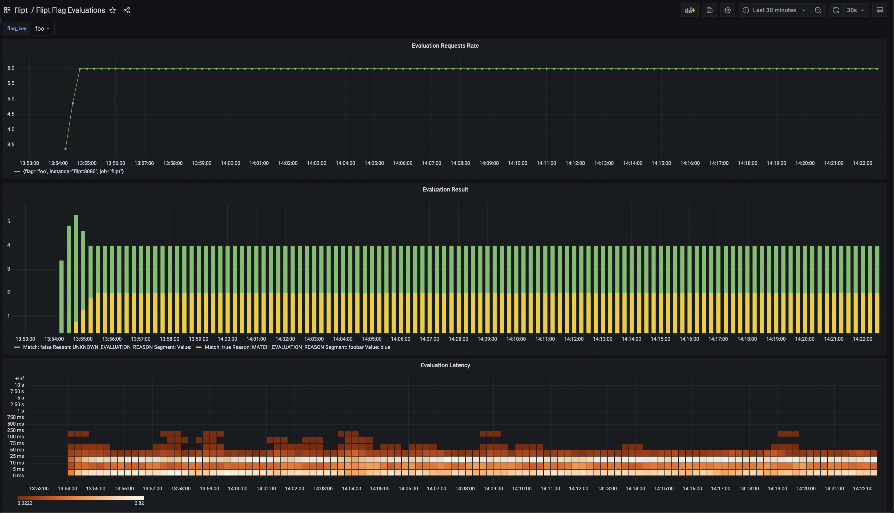

# Flipt Grafana Dashboards

---

This repository contains re-usable [Grafana](https://grafana.com) dashboards.

This project contains an example docker compose Flipt setup, which demonstrates the dashboards.
The dashboards, datasources and prometheus are all configured based on this scenario.



## Dependencies

- [Docker](https://www.docker.com/)
- [Docker Compose](https://docs.docker.com/compose/)

## Example

Simply run docker-compose to see an example monitoring scenario for Flipt.
The compose setup is configured with a single instance of each of the following:

- Postgres
- Prometheus
- Flipt
- Grafana

```sh
docker-compose up
```

Navigate to [Grafana](http://localhost:3000) in your browser and login with the default credentials:

- Username: `admin`
- Password: `admin`

## Installation

The dashboards in the `dashboards/Flipt` folder can be simply imported using Grafana's `import` functionality.
You may need to adjust the name, `uid` and potentially the datasources in your scenario.
This will depend on how and where you configure and run prometheus.
